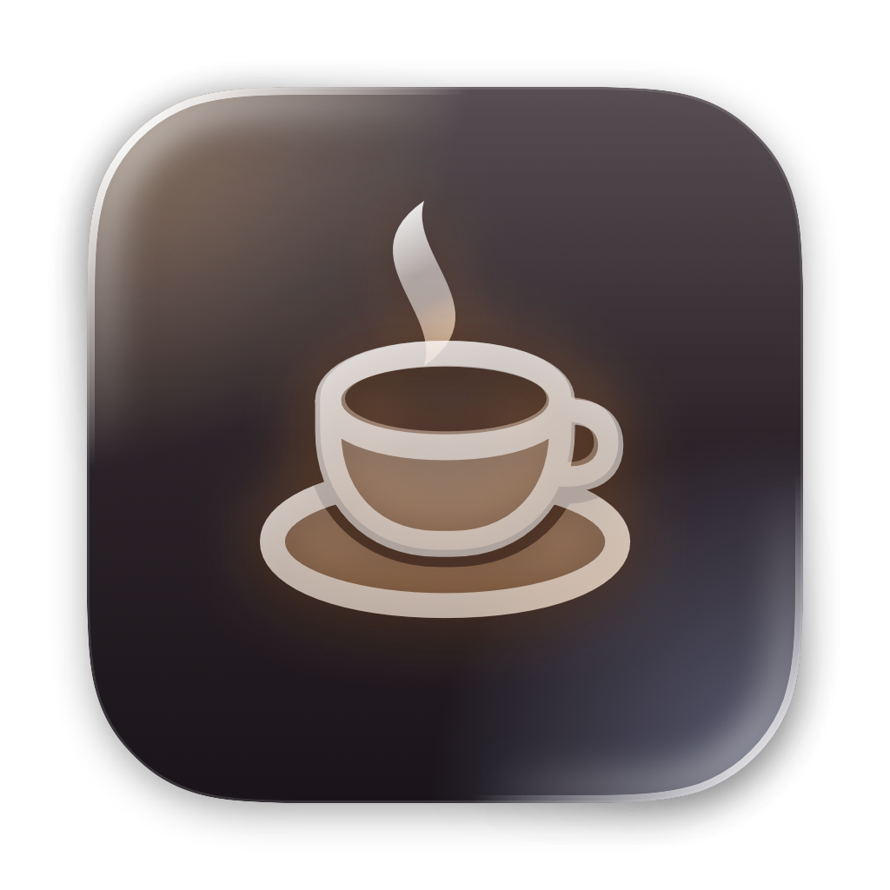

# Sleepless

*Русская версия: [README_ru.md](README_ru.md)*



A menu bar switch that keeps a MacBook running with the lid closed. Close the lid and the
screen goes dark, but the Mac stays awake: music keeps playing, downloads finish, SSH and
Screen Sharing stay reachable, background jobs carry on. Flip the switch off and everything is
back to normal sleep.

## Using it

- **Click** the cup in the menu bar to open the panel and flip **Don't sleep when the lid is closed**.
  While it's on, the cup fills in and steams.
- **Right-click** the cup for a quick menu with the same switch and Quit.
- **Open at login** in the panel starts Sleepless with your Mac.
- **Control Center** (macOS 26): open Control Center → **Edit Controls**, find Sleepless and drag
  the switch in. From there it can also go into the menu bar.

## Safety

Normal sleep comes back on its own when:

- you turn the switch off or quit Sleepless (also on logout, shutdown, `killall`);
- the battery drops to **10%** while unplugged — the Mac can then sleep instead of dying;
- macOS reports a **critical thermal state** — don't carry a closed, working Mac in a bag;
- the Mac restarts — a boot-time job resets the flag, even after a crash or forced shutdown.

The switch can't be turned on while one of those conditions holds.

## How it works

macOS sleeps on lid close unless an external display is attached. The only supported way to
override that is the system-wide `SleepDisabled` flag, set with `pmset -a disablesleep 1`, which
needs root. Sleepless doesn't run anything as root itself; the installer adds two small files:

| File | Purpose |
| --- | --- |
| `/etc/sudoers.d/sleepless` | Lets admin users run exactly `/usr/bin/pmset -a disablesleep 0` and `… 1` without a password. Validated with `visudo` before it's written. |
| `/Library/LaunchDaemons/dev.mihalevich.sleepless.reset.plist` | Runs `pmset -a disablesleep 0` at boot. |

If the app was copied without the installer, it installs the same files on first use behind the
standard macOS administrator prompt.

With `SleepDisabled` set, macOS also leaves the built-in screen and keyboard backlight on under a
closed lid. So when the lid closes while the switch is on, Sleepless puts the display to sleep
(`pmset displaysleepnow`, no root needed), and the screen comes back when the lid opens. With an
external display attached it leaves the displays alone.

## Updates and privacy

At launch and then once a day, Sleepless asks `sleepless.nextwell.top` for the current version number. When a
newer one exists, a note at the bottom of the panel links to the site. Nothing is downloaded or installed by itself.

That request is the only time the app uses the network, and it says nothing about your Mac, about you or
about the copy you run: the app sends only its name (`User-Agent: Sleepless`) and compares the answer with its own
version itself. The site counts these requests, and the clicks on the
download button, to see whether the app is in use. For that it stores a salted hash of the IP address, not the
address; the salt is replaced every month, so the hashes can't be traced back. The web server also keeps an
ordinary access log, as any site does.

To turn the check off:

```sh
defaults write dev.mihalevich.sleepless checksForUpdates -bool NO
```

## Install

Download `Sleepless-<version>.pkg` from [sleepless.nextwell.top](https://sleepless.nextwell.top) or
[Releases](../../releases) and open it. The package is signed and notarized by Apple.

Requires macOS 14 or later; the Liquid Glass interface needs macOS 26. Apple silicon and Intel.
Speaks English, Chinese, French, German, Japanese, Korean, Polish, Portuguese, Russian, Spanish,
Turkish and Ukrainian, following the system language (English otherwise).

## Uninstall

```sh
sudo sh /Applications/Sleepless.app/Contents/Resources/uninstall.sh
```

Removes the app, the sudoers rule and the boot job, and restores normal sleep.

## Build

Needs Xcode 26 (it doesn't have to be the one `xcode-select` points to) and XcodeGen
(`brew install xcodegen`). The Xcode project is generated from `project.yml`.

```sh
./Scripts/build.sh            # dist/Sleepless.app and dist/Sleepless-<version>.pkg
swift Scripts/make-icon.swift # regenerate Resources/AppIcon.icns
```

The Control Center switch lives in a sandboxed WidgetKit extension (`Control/`). The sandbox
can't run `sudo`, so the extension leaves the request in a shared app group and pings the app with
a Darwin notification; the app applies it and publishes the new state back the same way.

The app is signed with the first `Developer ID Application` identity in the keychain (ad hoc if
there's none). Set `INSTALLER_IDENTITY` to sign the package and `NOTARY_PROFILE` (a
`notarytool store-credentials` profile) to notarize and staple it.
